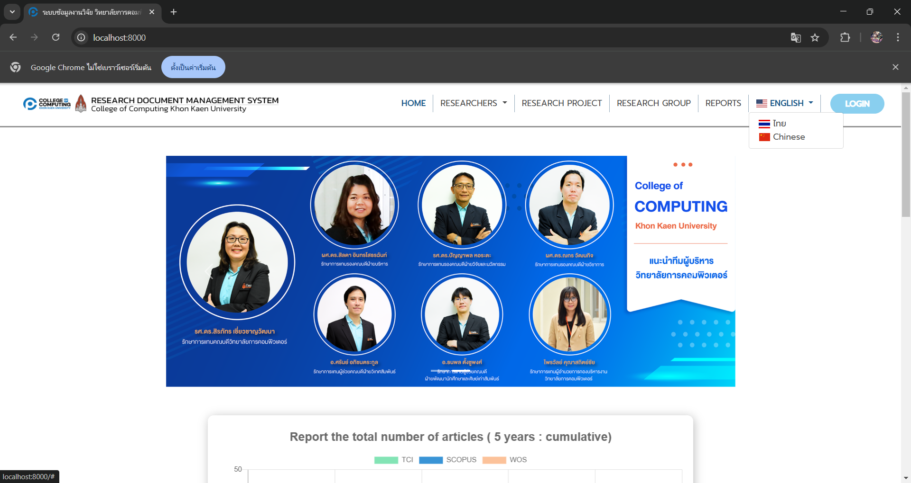
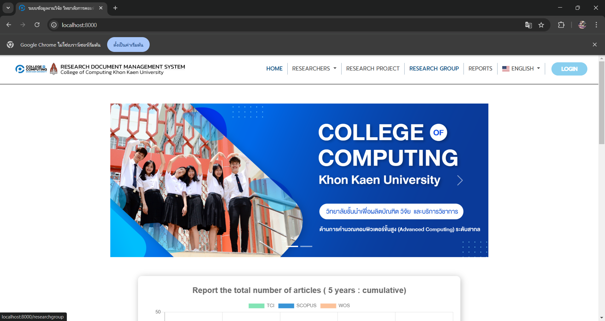
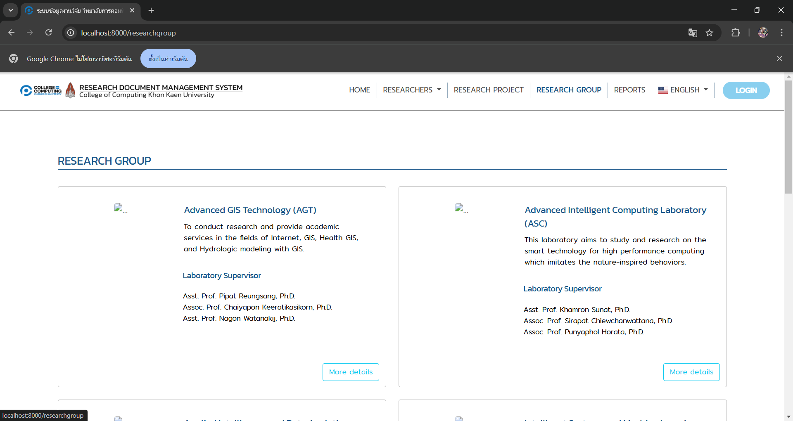
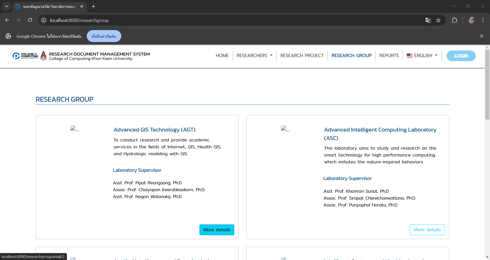
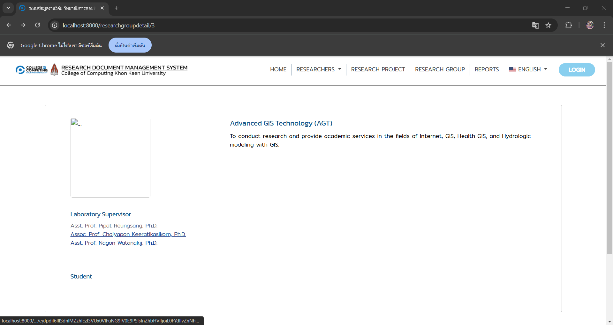
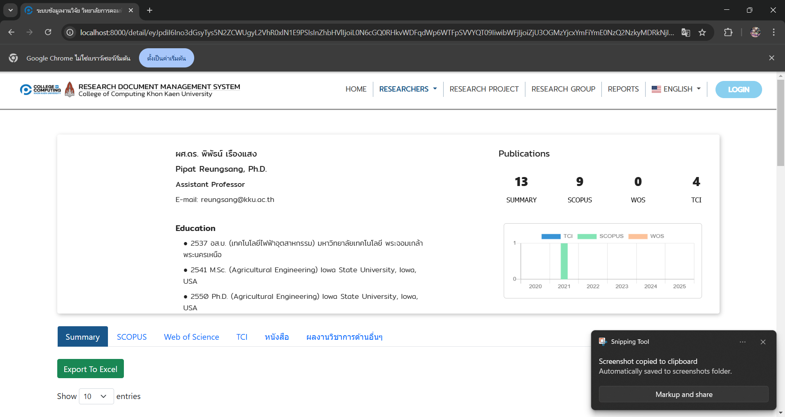

# คู่มือการใช้งานระบบ(User Manual)

## 1. การเปลี่ยนภาษา 
1. กดเมนูภาษาที่เขียนว่า English
2. เลือกภาษาที่ต้องการ

 
 

## 2. การดูข้อมูลกลุ่มวิจัยและนักวิจัย
1. กดเมนู RESEARCH GROUP

 
 

2. กดปุ่ม More detail กลุ่มที่สนใจ

 
 

3. กดที่ชื่อนักวิจัยที่สนใจ

