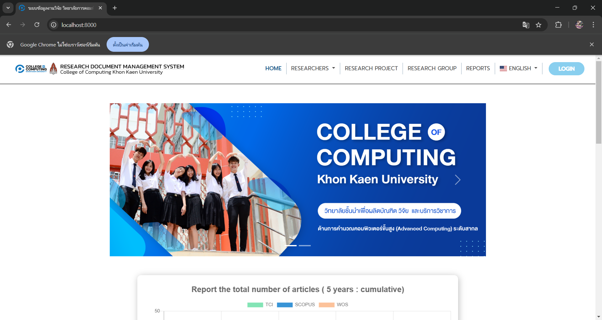
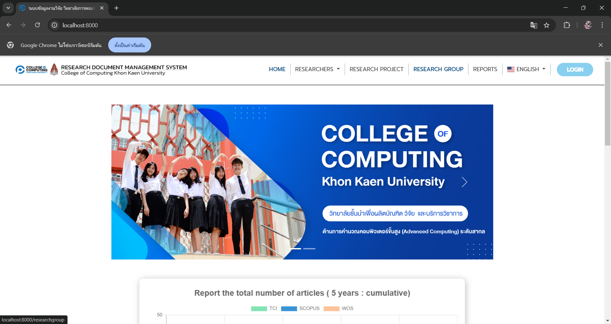
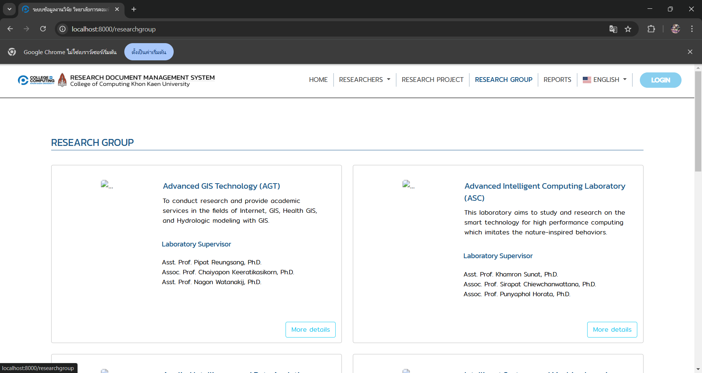
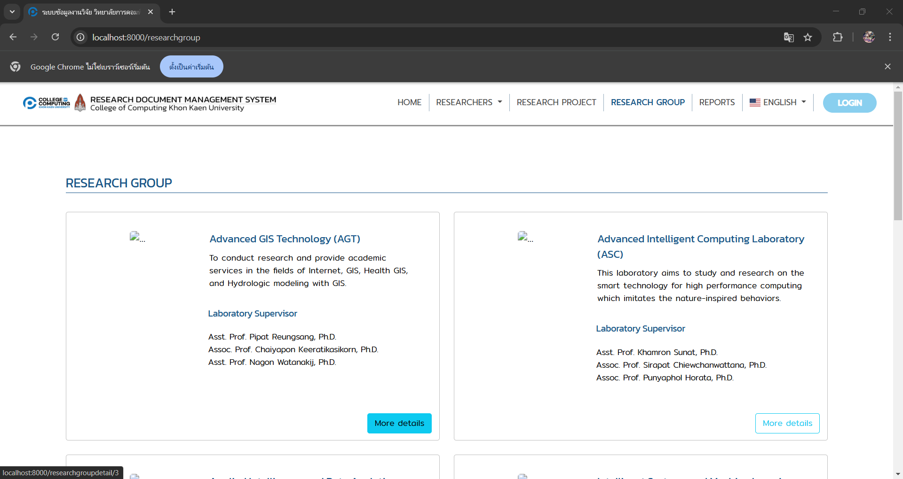
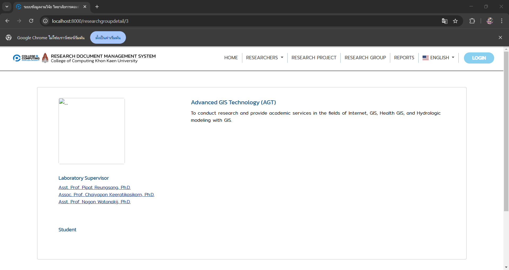
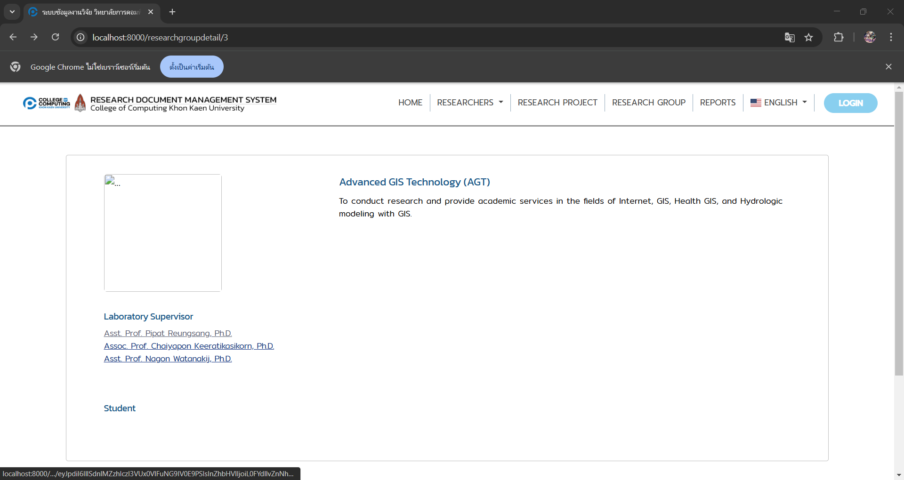
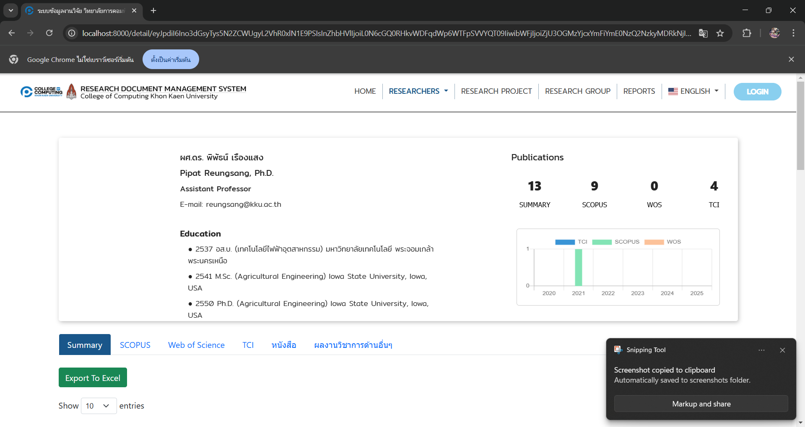

# คู่มือการใช้งานระบบ (User Manual)

Sprint-1

 
 

User -  all user
 
1. กดเมนู **RESEARCH GROUP**  

 
 

2. กดปุ่ม **More detail** ของกลุ่มที่สนใจแล้วจะสามารถดูงานวิจัยที่เกี่ยวข้อง อีกทั้งยังสามารถกดชื่อสมาชิกในกลุ่มเพื่อดูข้อมูลได้อีกด้วย

 
 

 
 

### 2. สร้างประกาศรับสมัครคนเข้าร่วมทำวิจัย
#### วิธีดูข้อมูล  

