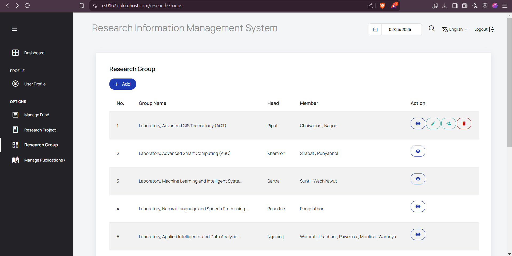

# คู่มือการใช้งานระบบ (User Manual)

Sprint-2

### 1. การดูข้อมูลกลุ่มวิจัยและนักวิจัย
#### วิธีดูข้อมูล  

 
 

User -  all user
 
1. กดเมนู **RESEARCH GROUP**  

  

 

 
 

2. กดปุ่ม **More detail** ของกลุ่มที่สนใจแล้วจะสามารถดูงานวิจัยที่เกี่ยวข้อง อีกทั้งยังสามารถกดชื่อสมาชิกในกลุ่มเพื่อดูข้อมูลได้อีกด้วย

 
 

 
 

### 2. สร้างประกาศรับสมัครคนเข้าร่วมทำวิจัย
#### วิธีดูข้อมูล  

User - หัวหน้ากลุ่มวิจัย

1. เมื่อเข้าสู่ระบบและเข้ามายังหน้า RESEARCH GROUP แล้ว หัวหน้ากลุ่มวิจัยจะสามารถกดปุ่ม **เพิ่มการประกาศรับสมัคร** ได้

  

 
 

2. หัวหน้ากลุ่มวิจัยจะสามารถ **สร้างโปรเจ็ค** ที่ต้องการเปิดรับสมัคร

 

 

 

 

 
 

3. หัวหน้ากลุ่มวิจัยจะสามารถ **สร้างประกาศรับสมัครภายใต้โปรเจ็ค** นั้น ๆ ได้

   

 

 

 

 

 
 

User - all user

1. เมื่อผู้ใช้เข้ามาที่หน้า **RESEARCH GROUP** จะสามารถเห็นได้ว่ามีกลุ่มวิจัยใดบ้างที่เปิดรับสมัคร

  

 
 

2. เมื่อผู้ใช้เข้ามาที่หน้า **รายละเอียดกลุ่มวิจัย** จะสามารถเห็นประกาศการเปิดรับสมัครทั้งหมดภายในกลุ่มนี้

 

 
 

3. เมื่อผู้ใช้สามารถเข้าไปดูรายละเอียดการเปิดรับสมัครได้

 

