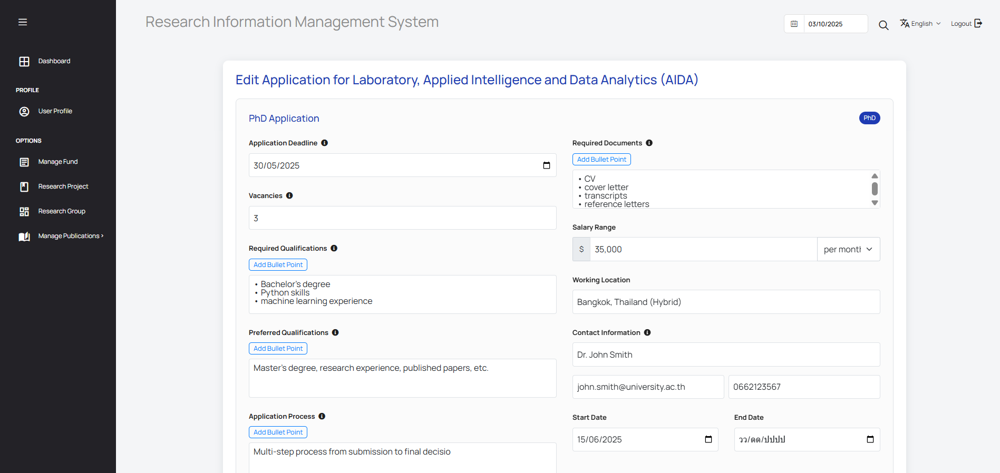

# คู่มือการใช้งานระบบ (User Manual)

Sprint-3

### สร้างประกาศรับสมัครคนเข้าร่วมทำวิจัย
#### วิธีดูข้อมูล  

User - หัวหน้ากลุ่มวิจัย

1. การเข้าสู่ระบบ (Login)

ผู้ใช้ต้องเข้าสู่ระบบก่อนเพื่อใช้งานระบบประกาศรับสมัคร

 

 
 

2. การเพิ่มประกาศรับสมัคร

เมื่อเข้าสู่ระบบและมาที่หน้า RESEARCH GROUP หัวหน้ากลุ่มวิจัยสามารถกดปุ่ม เพิ่มการประกาศรับสมัคร เพื่อสร้างประกาศใหม่

 

 
 
 
 

3. การสร้างประกาศรับสมัคร (Create Application)

หัวหน้ากลุ่มวิจัยสามารถสร้างประกาศรับสมัคร โดยกรอกข้อมูลในแต่ละฟิลด์ดังนี้

    3.1 เลือกตำแหน่ง (Select Position)

    เลือกตำแหน่งที่เปิดรับสมัคร มี 3 ตัวเลือก: ผู้ช่วยวิจัย (Research Assistant) ปริญญาเอก (Ph.D.) นักวิจัยหลังปริญญาเอก (Postdoc)

    เมื่อเลือกแล้ว จะปรากฏฟิลด์เพิ่มเติมสำหรับกรอกรายละเอียด

 

    3.2 กำหนดเวลาปิดรับสมัคร (Application Deadline) เลือกวันที่จากปฏิทิน

    3.3 จำนวนอัตราที่เปิดรับ (Vacancies) กรอกจำนวนตำแหน่งที่เปิดรับสมัคร

    3.4 คุณสมบัติที่ต้องการ (Required Qualifications) ระบุคุณสมบัติที่จำเป็น เช่น ปริญญาเอกในสาขาที่เกี่ยวข้อง, ประสบการณ์วิจัยมากกว่า 3 ปี, ผลงานตีพิมพ์ที่โดดเด่น

    3.5 คุณสมบัติที่พึงประสงค์ (Preferred Qualifications) ระบุคุณสมบัติที่พึงมี เช่น ประสบการณ์การเขียนข้อเสนอโครงการวิจัย, ประสบการณ์สอน

    3.6 เอกสารที่ต้องใช้ในการสมัคร (Required Documents) ประวัติส่วนตัว (CV/Resume)   จดหมายแนะนำตัว (Cover Letter)
    คำชี้แจงเกี่ยวกับงานวิจัย (Research Statement) รายชื่อบุคคลอ้างอิง (References)

    3.7 ช่วงเงินเดือน (Salary Range) กรอกช่วงเงินเดือนที่เสนอให้ และเลือกหน่วยเงินเดือน ได้แก่: รายชั่วโมง (per hour) รายวัน (per day) รายสัปดาห์ (per week) รายเดือน (per month) รายปี (per year) ตามสัญญา (per contract) ตามโครงการ (per project)

    3.8 สถานที่ปฏิบัติงาน (Working Location) ระบุสถานที่ปฏิบัติงาน

    3.9 ข้อมูลติดต่อ (Contact Information)  กรอกข้อมูลผู้ติดต่อ เช่น ชื่อ, อีเมล, หมายเลขโทรศัพท์

    3.10 วันที่เริ่มงาน (Start Date) เลือกวันที่จากปฏิทิน

    3.11 วันที่สิ้นสุดสัญญา (End Date) เลือกวันที่จากปฏิทิน

    3.12 กระบวนการสมัคร (Application Process) ระบุขั้นตอนการสมัคร เช่น: ส่งใบสมัครผ่านพอร์ทัลออนไลน์ คณะกรรมการคัดกรองเบื้องต้น การสัมภาษณ์รอบแรก การคัดเลือกขั้นสุดท้าย
    

    3.13 ช่องข้อมูลเพิ่มเติม (Custom Fields) สามารถเพิ่มหัวข้อหรือข้อมูลเพิ่มเติมได้โดยกด Add Custom Field
        Field Label: ชื่อของช่องข้อมูล เช่น ทักษะที่ต้องการ (Required Skills)
        Field Type: เลือกรูปแบบข้อมูล (Short Text, Long Text, Date, Number)
        Field Placeholder: ใส่ข้อความตัวอย่าง เช่น "ระบุทักษะที่จำเป็น เช่น การเขียนโปรแกรม, การวิเคราะห์ข้อมูล"

    3.14 ช่องข้อมูลสำหรับผู้สมัคร (Custom Application Fields) ผู้สมัครต้องกรอกรายละเอียดตามที่กำหนดจาก Custom Fields

    3.15 รายละเอียดใบสมัคร (Application Details) ใช้เพื่อให้ข้อมูลเกี่ยวกับตำแหน่งงาน โครงการวิจัย หรือข้อกำหนดของใบสมัคร

 
 

4. การบันทึกและตรวจสอบข้อมูล

หลังจากกรอกรายละเอียดทั้งหมดแล้ว กด Submit เพื่อบันทึกข้อมูล

สามารถคลิก View Details เพื่อตรวจสอบข้อมูลที่กรอก

หากพบข้อมูลผิดพลาด ให้คลิก Edit เพื่อแก้ไขและกด Update

 

หากต้องการลบประกาศ กด Delete ได้ 

 
 

User - all user

1. การดูประกาศรับสมัคร
ไปที่หน้า RESEARCH GROUP

 

 

เห็นประกาศรับสมัครที่แสดงสัญลักษณ์ Open for Application

 

คลิก Details เพื่อดูเนื้อหาของประกาศ

 
 

2. การดูรายละเอียดประกาศ

เมื่อเข้ามาที่ Research Group Details จะเห็นรายการ Job Openings พร้อมข้อมูลสรุป

หากต้องการดูรายละเอียดทั้งหมด กด View Details ระบบจะแสดงข้อมูลทั้งหมดที่หัวหน้ากลุ่มวิจัยได้กรอกไว้

 
 

